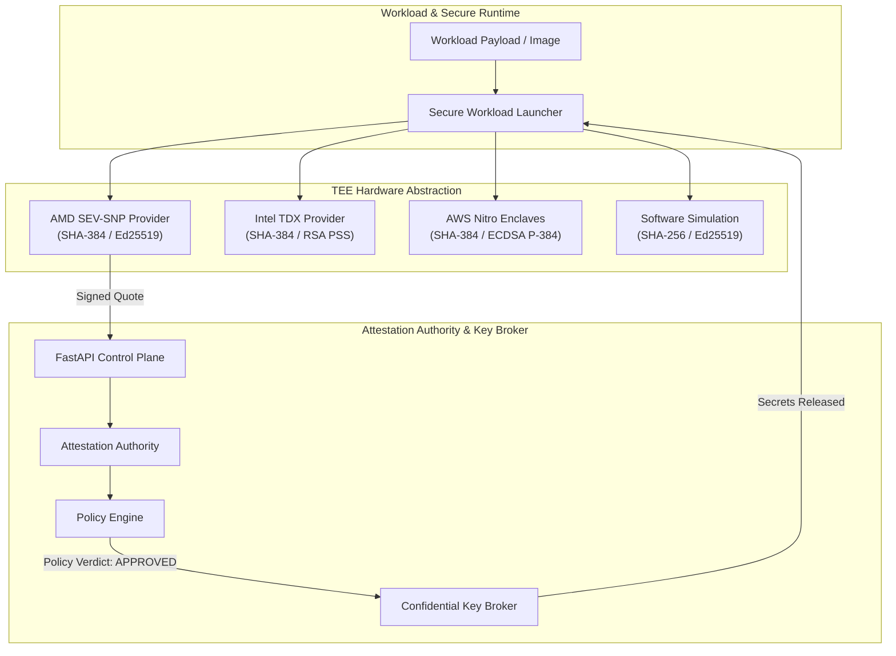

# Confidential Computing Research Framework (`confidential-computing-research-framework`)

[](https://www.python.org/downloads/release/python-3120/)
[](https://github.com/shamddd/confidential-computing-research-framework/actions/workflows/ci.yml)
[](LICENSE)
[](Dockerfile)

> A production-grade research and engineering framework for hardware-backed Confidential Execution Environments (AMD SEV-SNP, Intel TDX, AWS Nitro Enclaves), remote attestation verification, security policy evaluation, and confidential secret brokerage.

---

## Why This Project Exists

Confidential Computing protects data in use by processing workloads inside hardware-isolated enclaves with memory encryption (AES-XTS/MKTME). This repository bridges the gap between hardware TEE specifications and cloud security engineering by providing a unified Python framework for remote attestation quote validation, security policy evaluation, signed credential issuance, and secret brokerage.

---

## Architecture



---

## Hardware vs. Simulation Demarcation

To maintain absolute technical integrity, hardware dependencies are explicitly demarcated:

| Component | Status | Implementation Details |
| :--- | :--- | :--- |
| **Quote Signature Verification** | `REAL IMPLEMENTATION` | Uses `cryptography` (Ed25519, RSA-2048 PSS, ECDSA P-384) to verify quotes. |
| **Policy Engine & Evaluation** | `REAL IMPLEMENTATION` | Evaluates launch measurement digests, PCR registers, allowable TEE types, and TTL. |
| **Attestation Authority Control Plane** | `REAL IMPLEMENTATION` | FastAPI REST API issuing cryptographically signed `AttestationToken` credentials. |
| **Measurement & Digest Hashing** | `REAL IMPLEMENTATION` | SHA-256 / SHA-384 pre-launch binary measurement hashing. |
| **Performance Benchmarks** | `REAL IMPLEMENTATION` | Measures real CPU latency for quote generation, signature validation, and policy checks. |
| **CPU Firmware ioctls** | `SIMULATION` | Mocked kernel guest drivers (`/dev/sev-guest`, `/dev/tdx-guest`) returning structured quotes. |

---

## Key Features

- **Multi-TEE Hardware Abstraction**: Supports AMD SEV-SNP, Intel TDX, AWS Nitro Enclaves, and Software Simulation.
- **Attestation Authority & Token Issuance**: Issues signed Ed25519 `AttestationToken` credentials upon quote verification.
- **Strict Key Brokerage**: Secret Key Broker releases secrets ONLY to enclaves presenting authentic, approved attestation tokens matching policy requirements.
- **Executable Benchmarks**: Automated performance suite measuring quote generation and signature verification latency in milliseconds.
- **FastAPI Control Plane**: Production-grade REST API exposing `/api/v1/attestation/verify` and `/api/v1/policies` endpoints.

---

## Technology Stack

- **Core Framework**: Python 3.12+, Pydantic v2, `cryptography`
- **Control Plane API**: FastAPI, Uvicorn, Starlette
- **Testing & Tooling**: `pytest`, `pytest-asyncio`, `pytest-cov`, `ruff`, `mypy`
- **Deployment**: Multi-stage Docker, Docker Compose, GitHub Actions CI

---

## Quick Start

### Installation & Setup

```bash
# Clone repository
git clone https://github.com/shamddd/confidential-computing-research-framework.git
cd confidential-computing-research-framework

# Install virtual environment and dependencies via uv
pip install uv
uv sync --extra dev

# Run unit and integration tests
uv run pytest
```

### Running with Docker

```bash
docker compose up --build
```

---

## Demo Experience

Run the interactive remote attestation and key release demonstration:

```bash
python scripts/run_attestation_demo.py
```

### Example Demo Output

```text
=================================================================
  CONFIDENTIAL COMPUTING RESEARCH FRAMEWORK — ATTESTATION DEMO
=================================================================

[Step 1] Stored confidential secret 'db_secret' in Key Broker bound to policy 'prod_db_policy'
[Step 2] Computed AMD SEV-SNP launch measurement digest: 8f3c42a1b9e012...
[Step 3] Registered Security Policy 'prod_db_policy' with trusted measurement

[Step 4] Launching Workload via Secure Workload Launcher...
  Launch Result: SUCCESS
  Attestation Token ID: tok-8f12a9c40b3d
  Provisioned Secrets: {'db_secret': 'db_master_password_confidential_99'}

[Step 5] Negative Security Test: Launching Tampered Workload Binary...
  Launch Result: REJECTED (as expected)
  Error Message: Attestation failed: ["Measurement hash 'c912e...' is not trusted"]
```

---

## Performance Benchmarks

Reproducible benchmark metrics measured over 50 iterations per provider:

| TEE Provider | Algorithm | Quote Generation (ms) | Signature Verification (ms) | Policy Evaluation (µs) | Total Latency (ms) |
| :--- | :--- | :--- | :--- | :--- | :--- |
| **SEVSNPProvider (AMD SEV-SNP)** | Ed25519 + SHA-384 | 0.1093 ms | 0.2059 ms | 310.92 µs | 0.6261 ms |
| **SimulatedTEEProvider (Software)** | Ed25519 + SHA-256 | 0.1054 ms | 0.2063 ms | 311.59 µs | 0.6233 ms |
| **TDXProvider (Intel TDX)** | RSA-2048 PSS + SHA-384 | 1.0932 ms | 0.0729 ms | 175.08 µs | 1.3412 ms |
| **NitroProvider (AWS Nitro Enclaves)** | ECDSA P-384 + SHA-384 | 0.6722 ms | 1.5812 ms | 1689.36 µs | 3.9428 ms |

---

## Research Documentation (`docs/`)

- [`docs/architecture.md`](docs/architecture.md): System architecture and component interactions.
- [`docs/threat-model.md`](docs/threat-model.md): Threat vectors, untrusted hypervisors, and attack surfaces.
- [`docs/attestation.md`](docs/attestation.md): Attestation sequence diagram and quote schema.
- [`docs/benchmarks.md`](docs/benchmarks.md): Detailed benchmark metrics and cryptographic algorithm analysis.
- [`docs/security-model.md`](docs/security-model.md): Key brokerage protocol and memory encryption guarantees.
- [`docs/research-notes.md`](docs/research-notes.md): Comparative analysis (KVM vs Containers vs CVMs vs TEEs).

---

## Project Structure

```text
confidential-computing-research-framework/
├── docs/                             # Engineering & Research Documentation
├── src/cc_framework/
│   ├── api/                          # FastAPI Attestation Control Plane
│   ├── attestation/                  # Authority, Policy Engine & Verifier
│   ├── benchmarks/                   # Executable Performance Benchmarking
│   ├── runtime/                      # Secure Launcher & Secret Key Broker
│   └── tee/                          # AMD SEV-SNP, Intel TDX, AWS Nitro Providers
├── tests/                            # Pytest Integration & Unit Suite
├── scripts/                          # Demo & Benchmark Executable Scripts
├── .github/workflows/                # CI Pipeline
├── Dockerfile                        # Multi-stage Container
└── README.md
```

---

## Author

**Sham Satish Thakare**
GitHub: [https://github.com/shamddd](https://github.com/shamddd)
