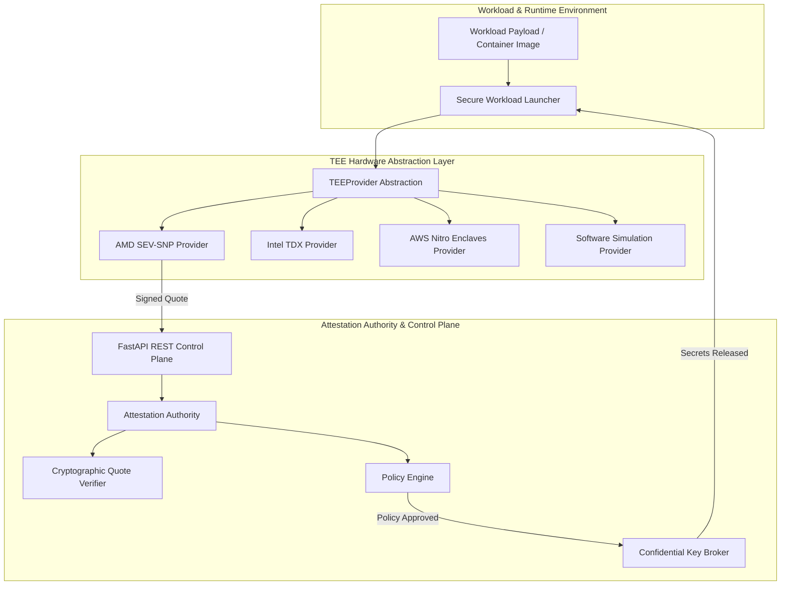

# Confidential Computing Framework Architecture

## System Overview

The **Confidential Computing Research Framework** provides a modular, hardware-abstracted architecture for remote attestation, security policy enforcement, and confidential workload execution.

## Subsystem Architecture

### 1. TEE Hardware Abstraction Layer (`cc_framework.tee`)
Defines the `TEEProvider` base class and concrete implementations for:
- **AMD SEV-SNP**: Cryptographic signatures using Ed25519; SHA-384 launch digests.
- **Intel TDX**: Cryptographic signatures using RSA-2048 PSS; MRTD/RTMR measurement digests.
- **AWS Nitro Enclaves**: Cryptographic signatures using ECDSA P-384; PCR0/PCR1/PCR2 measurements.
- **Software Simulation**: Software-emulated TPM2 PCR measurements for local development.

### 2. Remote Attestation Authority (`cc_framework.attestation`)
- **Quote Verifier**: Validates cryptographic signatures against trusted public keys.
- **Policy Engine**: Evaluates quote attributes, expected launch measurement hashes, and allowable TEE types.
- **Attestation Authority**: Issues cryptographically signed `AttestationToken` credentials upon successful verification.

### 3. Secure Runtime & Key Brokerage (`cc_framework.runtime`)
- **Key Broker**: Releases secrets and encryption keys ONLY upon presentation of an authentic, non-expired `AttestationToken` bound to the required policy ID.
- **Secure Launcher**: Orchestrates pre-execution measurement, remote quote submission, secret retrieval, and enclave bootstrapping.
