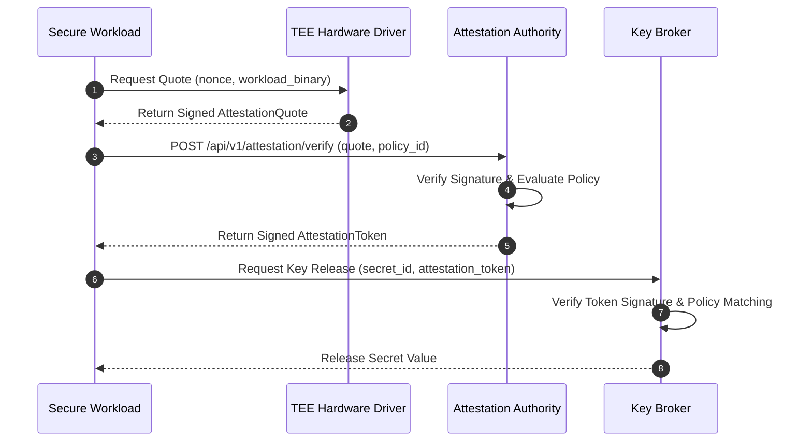

# Remote Attestation Protocol & Quote Specification

## Attestation Protocol Flow

## Attestation Quote Data Structure

Each quote contains:
- **`quote_id`**: Unique identifier for tracking and auditing.
- **`tee_type`**: Provider enum (`amd_sev_snp`, `intel_tdx`, `aws_nitro`, `software_simulation`).
- **`implementation_mode`**: Indicator (`REAL_HARDWARE` vs `SIMULATION`).
- **`measurement`**:
  - `measurement_hash`: SHA-256 or SHA-384 launch digest of the workload binary.
  - `pcr_values`: Dict mapping platform configuration registers (PCR0, PCR1, PCR2).
- **`user_data_hash`**: SHA-256 hash of the fresh challenge/nonce.
- **`signature`**: Base64-encoded cryptographic signature.
- **`public_key_pem`**: PEM-encoded public key used by the TEE provider.
